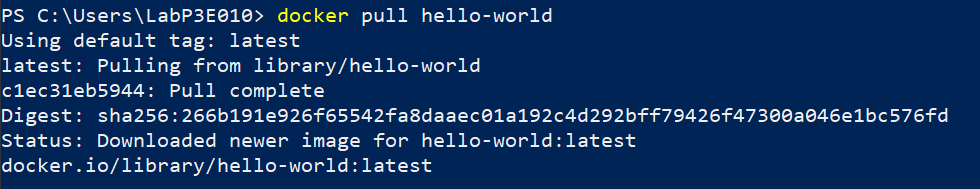
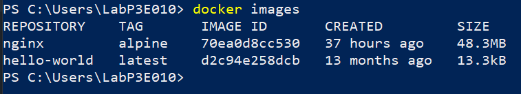

### Indicaciones para la práctica
El contenido solicitado entre paréntesis angulares debe ser reemplazado y los paréntesis angulares deben ser eliminados.

# Imagen
Es un archivo único que contiene todos los programas, librerías, dependencias y configuraciones necesarias para instalar y/o ejecutar una aplicación o un conjunto de aplicaciones.


## ¿Cuál es la relación entre una imagen y un contenedor? 
# COMPLETAR 


## Comandos para imágenes

### Descargar imagen
Descarga la última versión de la imagen disponible en el registro de Docker.

```
docker pull <nombre imagen> 
```

Descarga una versión específica de la imagen, cada imagen tiene etiquetas (tags) para diferentes versiones.
Una imagen puede tener la etiqueta latest para representar la última versión, si no se especifica una etiqueta se hará referencia a la versión latest.

```
docker pull <nombre imagen>:<tag>
```

Descargar la imagen **hello-world**

En la terminal una vez que se inicie sesión con una cuenta de Docker Desktop, iuntroducir el siguiente comando:
```
docker pull hello-world
```


**¿Qué es nginx**

NGINX es un software de servidor web de código abierto. En su versión inicial, funcionaba en servidores web HTTP. Sin embargo, hoy en día también sirve como proxy inverso, balanceador de carga HTTP y proxy de correo electrónico para IMAP, POP3 y SMTP. NGINX ofrece una arquitectura asíncrona y controlada por eventos, lo que lo hace confiable para la velocidad y la escalabilidad¹. Por su capacidad para manejar muchas conexiones y su velocidad, muchos sitios web de alto tráfico usan el servicio de NGINX.

Descargar la imagen  **nginx** en la versión **alpine**

En la terminal ejecutar el comando:
```terminal
docker pull nginx:alpine
```

### Listar imágenes

```
docker images
```



**Identificadores**
En Docker, se utilizan varios identificadores para diferenciar de manera única los elementos del sistema, como imágenes, contenedores, volúmenes y redes. Estos identificadores son generados automáticamente por Docker y son únicos dentro del contexto del sistema Docker en el que se encuentran. 

### Inspeccionar una imagen
El comando docker inspect se utiliza para obtener información detallada sobre un objeto de Docker específico, como un contenedor, una imagen, un volumen o una red.  Proporciona información en formato JSON sobre el objeto especificado.

```
docker inspect <nombre imagen>
docker inspect <nombre imagen>:<tag>
```

Inspeccionar la imagen hello-world 
En la terminal una vez que se inicie sesión con una ceunta de Docker hub, iuntroduciir el siguiente comando:
```
docker inspect <nombre imagen>
```

**¿Con qué algoritmo se está generando el ID de la imagen**

El ID de una imagen Docker se genera automáticamente cuando se construye una imagen. Este ID es un identificador único que Docker utiliza para referirse a la imagen en sus operaciones internas. Sin embargo, Docker no especifica públicamente el algoritmo exacto que utiliza para generar estos IDs. Es importante mencionar que puedes referirte a una imagen Docker por su ID completo, o por cualquier número único de caracteres iniciales del ID.

### Filtrar imágenes

```
docker images | grep <termino a buscar>

```

### Para eliminar una imagen
Eliminar permanentemente la imagen de tu sistema Docker.

```
docker rmi <nombre imagen>:<tag>
```

Eliminar la imagen hello-world 

Ejecutar el siguiente comando:
```
docker rmi hello-world:latest
```

-f: Es la opción para forzar la eliminación de la imagen incluso si hay contenedores en ejecución que utilizan esa imagen.
Cuando eliminas una imagen Docker, Docker no elimina automáticamente los contenedores que se han creado a partir de esa imagen. Esto significa que, aunque hayas eliminado la imagen, el contenedor seguirá ejecutándose normalmente.  
**Considerar**
Eliminar una imagen no afecta a los contenedores que se han creado a partir de esa imagen, a menos que esos contenedores dependan de archivos o configuraciones específicas de la imagen eliminada. En ese caso, es posible que los contenedores se comporten de manera inesperada después de eliminar la imagen.
Es una buena práctica detener y eliminar todos los contenedores que dependan de una imagen antes de eliminar la imagen en sí.

```
docker rmi -f <nombre imagen>:<tag>
```

